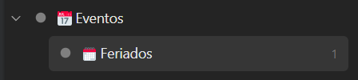
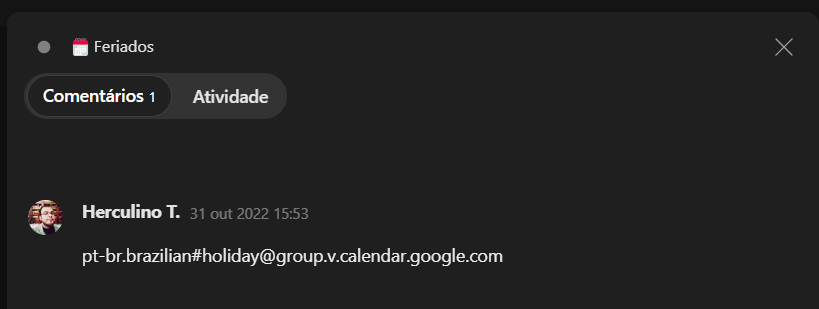

<h3 align="center">Google Calendar 2 Todoist</h3>
<p align="center">A one-way sync between Google Calendar events and Todoist.</p>

---

## What's this?
This script aims to mimick TickTick's Google Calendar sync.


### End Result
<div align="center">
    
</div>

Tasks created by this script are uncompletable and preceded by "🗓️", having the event start date as their due date, they are also added to their own project and assigned a custom label. Also a comment is added to each task with the events location and description.

Multiple day events get a task for each day, with older tasks getting completed each day.

Once an event is over, all tasks related to it will be automatically completed.

## Getting started

### docker-compose
A ``docker-compose.yml`` example file is provided within this repo. Use it to get started faster.

Make sure to setup your [credentials](#credentials) folder and [configs.yml](#configsyml)

### Manual mode

You will need:
1. Python 3.10+
1. A ``clone`` of this repo
1. Run ``pip install -r requirements.txt``
1. **.credentials** folder on the root of the script folder with your Google Calendar authentication files
1. Configure **configs.yml**
1. Run ``gcal2todoist.py``

### .credentials
Please refer to [Google Calendar Simple API's docs](https://google-calendar-simple-api.readthedocs.io/en/latest/getting_started.html#credentials) for a guide on how to create the ``.credentials`` folder

### configs.yml
Rename `configs.yml.example` to `configs.yml` and edit accordingly
```yaml
todoist_api_token: "YOUR_TODOIST_TOKEN_GENERATED_ON_THE_WEB_CLIENT"
default_project: "Events" # Name of the project you want your tasks to get added to. It will be created if it doesn't exist.
label: "Event" # Custom label to be added to each task created by the script.


keep_running: false # If false, script will run only once. Else it will run every n seconds
run_every: 600 # seconds

log_level: "INFO" # Currently only INFO level logs are avaliable.

completed_label: "Done" # Add this label to a event to complete it before it's given time (useful for full day events)

# Will fetch this number of days in advance. The higher this number
# the higher the amount of api calls, watch out for rate limiting
days_to_fetch: 7
```


### Syncing Calendars
To sync a calendar
1. Create a Todoist Project with the same name as the ``default_project`` set on ``configs.yml``.
1. Add a new project as a child of the default project (one project for each calendar you want to sync)

1. In this project add a project comment with the ID of the Google Calendar you want to sync

1. Run this script


## Contributing
Due to the lack of a start and end date on Todoist tasks, syncing with Google Calendar poses an interesting challenge, if you feel like you can improve this script please open an issue or a pull request, they are very much welcome.

*For major changes, please open an issue first to discuss what you would like to change.*

## License
[MIT](https://choosealicense.com/licenses/mit/)